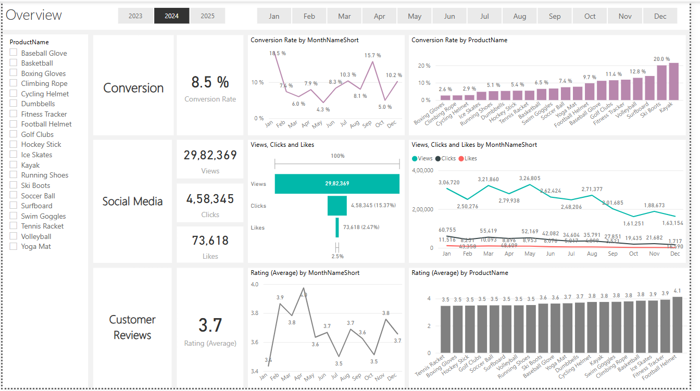

# Marketing Analytics Project

## Project Demo & Key Insights

**Overview:** 
[](Images/Overview.png)


**Key Insights at a Glance:**  
- **Conversion Rate Fluctuations:** Conversion rates varied throughout the year, with peaks in January (18.5%) and lows in May (4.3%). Seasonal trends influence purchase behavior, indicating that marketing efforts should be aligned with demand cycles.

- **Customer Engagement Challenges:** Views and interactions with marketing content declined from August onwards, suggesting a need for stronger engagement strategies such as interactive content and optimized call-to-actions.

- **Customer Sentiment Analysis:** While the majority of customer reviews are positive (4-5 stars), the average rating of 3.7 indicates room for improvement. Addressing negative feedback (from 1-2 star reviews) could improve overall satisfaction.

- **Click-Through Rate Efficiency:** Despite declining engagement, the click-through rate remains at 15.37%, showing that engaged users are still interacting effectively. Enhancing content strategy could boost total engagement.

- **Product-Specific Trends:** Some products, like Ski Boots, had exceptional conversion rates (150%), highlighting the impact of seasonality and targeted marketing.

---

## Overview

This project combines robust data processing, sentiment analysis, and interactive data visualizations to provide actionable insights for marketing strategies. By integrating multiple data sources, the project supports:

- **Interactive Reporting:** A Power BI dashboard (`Dashboard.pbix`) that visualizes key marketing metrics.
- **Data Preparation:** SQL scripts and Python code to process and analyze raw data.
- **Strategic Insights:** Comprehensive analysis of customer sentiment and campaign performance to drive informed decision-making.

---

## How to Use

### Prerequisites
- **Power BI Desktop:** To open and interact with `Dashboard.pbix`.
- **SQL Server:** To restore and explore the `MarketingAnalyticsData.bak` database.
- **Python 3.x:** To run the sentiment analysis script. Ensure you have the necessary libraries installed (e.g., `pandas`, `nltk`, etc.).

### Installation & Setup

1. **Clone the Repository:**
   ```bash
   git clone https://github.com/your-username/your-repo.git
   ```
2. **Database Setup:**
   - Restore the database from `Data/MarketingAnalyticsData.bak` using SQL Server.
3. **Dashboard:**
   - Open `Dashboard.pbix` in Power BI Desktop to view interactive visualizations.
4. **Run Sentiment Analysis:**
   - Execute the Python script:
     ```bash
     python Scripts/CustomerReviewSentimentAnalysis.py
     ```
   - This script processes `Data/CustomerReviewSentiment.csv` and outputs sentiment scores for further analysis.

---

## Project Snippets & Detailed Insights

### Project Snippets

```python
# Example snippet from CustomerReviewSentimentAnalysis.py
import pandas as pd
import nltk

# Load customer reviews
df = pd.read_csv('Data/fact_customer_reviews_with_sentiment.csv')
# Perform sentiment analysis...
```

### Detailed Insights from Data Analysis
- **Seasonal Impact on Conversion Rates:**
Conversion rates peaked in January at 18.5%, largely driven by winter-related products like Ski Boots, which had an impressive 150% conversion rate. However, May had the lowest conversion rate at 4.3%, indicating the need for strategic promotions or seasonal marketing adjustments during weaker months.

- **Customer Sentiment and Its Impact on Sales:**
The majority of customer reviews were positive (4-5 stars), but the overall average rating remained at 3.7, below the target of 4.0. Addressing recurring negative feedback (e.g., low-rated products) could improve sales and customer retention. Products rated below 3.5 saw lower engagement, showing a direct link between sentiment and conversion rates.

- **Engagement Drop in Late Year:**
Engagement metrics declined steadily after July, with views and interactions dropping from August onward. Click-through rates remained at 15.37%, meaning engaged users were still interacting, but overall traffic was down. This suggests the need for more engaging content formats, optimized call-to-actions, and targeted campaigns in Q4.

---

## Folder Structure

```
Project_MarketingAnalytics/
├── Dashboard.pbix                     # Power BI dashboard 
├── Data/
│   ├── fact_customer_reviews_with_sentiment.csv  # Processed Customer review
│   └── MarketingAnalyticsData.bak     # Database backup
├── Docs/
│   ├── Marketing Analytics Business Case.pptx  # Business case presentation
│   └── Presentation.pptx                   # Additional presentation slides
└── Scripts/
    ├── Calendar DAX Script.txt             # DAX script for time intelligence calculations
    ├── CustomerReviewSentimentAnalysis.py  # Sentiment analysis script
    └── SQL/                                # SQL Queries    
```
---

## Additional Information

- **Future Enhancements:** Planned improvements include integrating real-time data feeds and expanding sentiment analysis capabilities.
- **Contributing:** Contributions are welcome! Please open an issue or submit a pull request with your suggestions.
- **References:**  
  - [Power BI Documentation](https://docs.microsoft.com/en-us/power-bi/)
  - [Python Sentiment Analysis Libraries](https://www.nltk.org/)

---

## License

This project is licensed under the MIT License. See the [LICENSE](LICENSE) file for details.

---

## Contact

For questions, suggestions, or further discussion, please contact:  
**Your Name** – [your-email@example.com](mailto:abhinavdornala777@gmail.com)